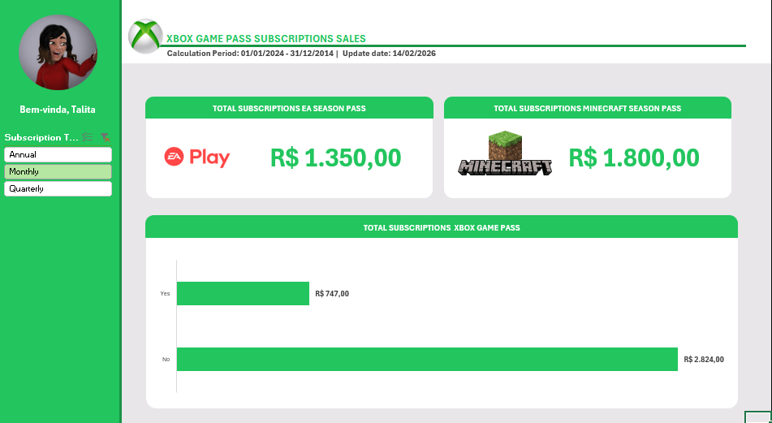
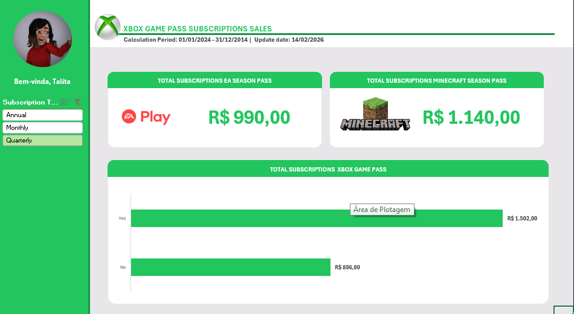
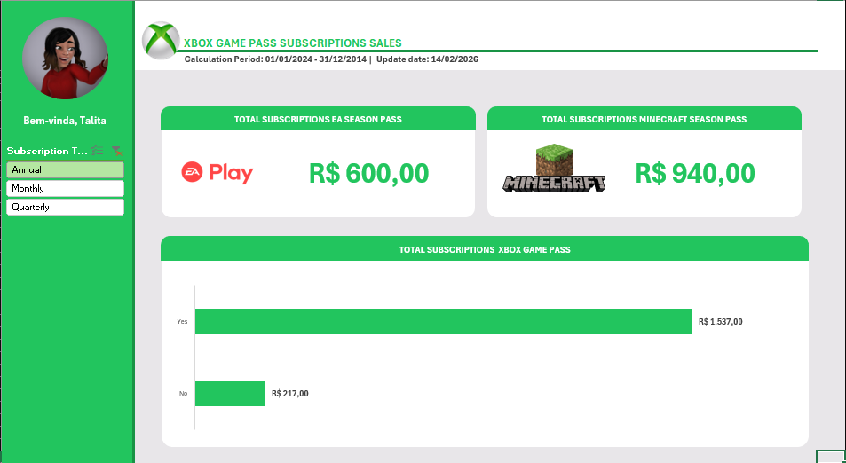

# Dashboard de Vendas - Xbox Game Pass

Este projeto foi desenvolvido como parte do desafio final do bootcamp **Santander - Excel com Inteligência Artificial - 2° Semestre (DIO)**.  
O objetivo é criar um **dashboard de vendas** que transforme dados brutos em informações visuais claras e úteis, permitindo análise eficaz do desempenho e suporte à tomada de decisões.

---

## 📂 Estrutura do Projeto
```
📂 dashboard-vendas-xbox
 ├── 📄 README.md
 ├── 📊 Excel com IA - XBOX GAME PASS.xlsx
 └── 📂 imagens
      ├── xbox_quarterly.png
      ├── xbox_monthly.png
      └── xbox_annual.png
```
---

## 🚀 Como Reproduzir

1. Clone este repositório:
 ```bash
 git clone https://github.com/tatahvelasco/xbox-gamepass-analytics-DIO.git
 ```
2. Abra o arquivo [Excel com IA - XBOX GAME PASS.xlsx](https://github.com/tatahvelasco/xbox-gamepass-analytics-DIO/blob/main/Excel%20com%20IA%20-%20XBOX%20GAME%20PASS.xlsx) no Excel.
3. Explore os gráficos, filtros e indicadores disponíveis.

--- 

## 🛠️ Tecnologias Utilizadas 

- Microsoft Excel (gráficos dinâmicos, tabelas e indicadores)
- GitHub para versionamento e compartilhamento

  
--- 

## 📸 Exemplos de Visualização

- **Mensal:**  
  

- **Trimestral:**  
  

- **Anual:**  
  


--- 

## 👩‍💻 Autor 
Desenvolvido por **Talita Velasco** como parte do bootcamp [Santander - Excel com Inteligência Artificial (DIO)](https://web.dio.me/track/santander-excel-com-inteligencia-artificial-2-semestre?tab=about)
